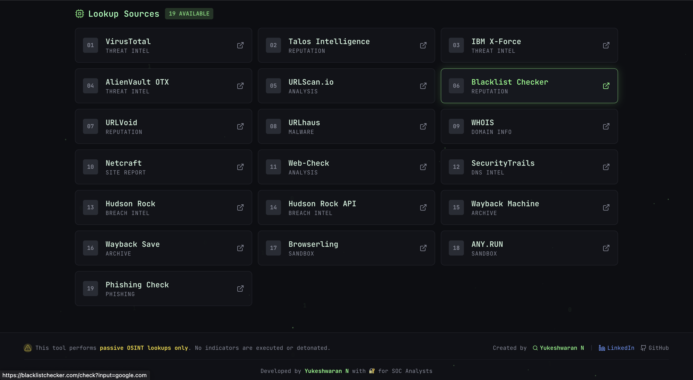

# 🛡️ SOC Analyst Toolkit

A powerful, modern web-based **IOC (Indicator of Compromise) investigation dashboard** built for cybersecurity professionals.  
This toolkit streamlines threat-intelligence workflows through **automated IOC detection** and **passive OSINT lookups**, aligned with real SOC L1/L2 operations.

---

## 🎥 Live Demo


---

## 🖥️ Dashboard Preview


---

## 🔍 IOC Investigation Example



---

## ✨ Features

### 🔍 Intelligent IOC Detection
- **Automatic detection** of multiple IOC types:
  - **Domains & URLs** (e.g., `example.com`, `https://malicious.site/path`)
  - **IP Addresses** (IPv4)
  - **Email Addresses** (e.g., `phishing@bad.com`)
  - **File Hashes** (MD5, SHA1, SHA256)
  - **Raw text / keywords**
- **Real-time IOC type recognition**
- **Defanged IOC output** for safe handling and reporting

---

### 🔗 Integrated Lookup Sources
- Built-in **passive OSINT** platforms:
  - VirusTotal
  - URLScan.io
  - AbuseIPDB
  - Shodan
  - Hybrid Analysis
  - Cisco Talos
  - ThreatFox
  - MalwareBazaar
  - And more…
- **Context-aware source selection** based on IOC type
- **One-click “Open All”** to launch all relevant lookups instantly

---

### 📋 Analysis & Productivity Tools
- Dual IOC display:
  - **Normal format**
  - **Defanged format**
- One-click **copy buttons**
- Example IOCs for fast testing
- Clean results layout with smooth animations

---

### ⚡ Performance & UX
- Fully **client-side** (no API keys required)
- Fast analysis with visual feedback
- Animated loading screen
- Keyboard shortcuts (**Enter** to analyze)
- Toast notifications
- Smooth hover and transition effects

---

## 🚀 Quick Start

### Prerequisites
- **Node.js 18+**
- npm or yarn
- Modern web browser

---

### Installation

```bash
# Clone the repository
git clone https://github.com/yourusername/soc-analyst-toolkit.git
cd soc-analyst-toolkit

# Install dependencies
npm install

# Start the development server
npm run dev
